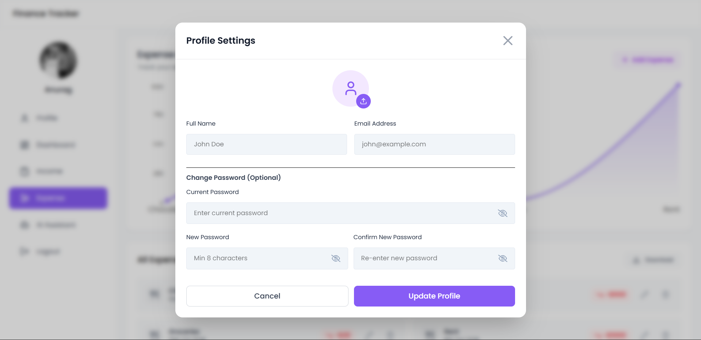
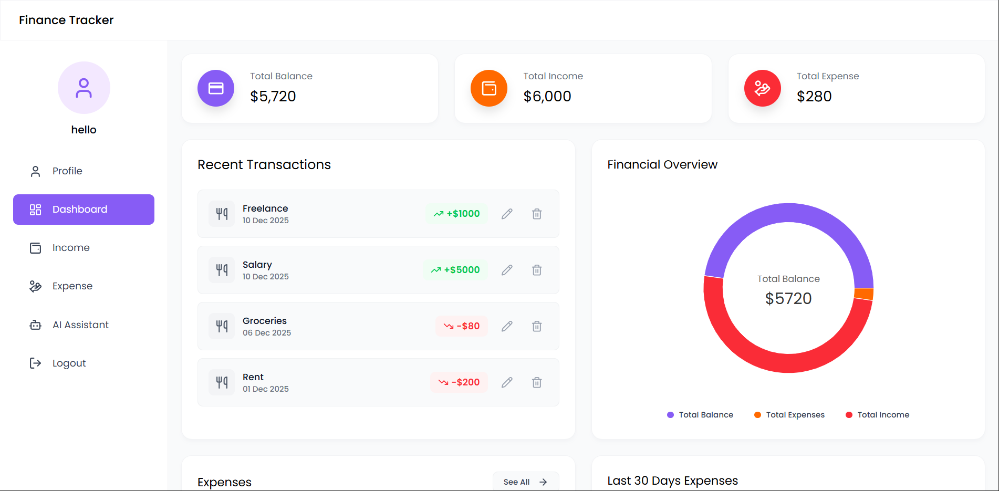
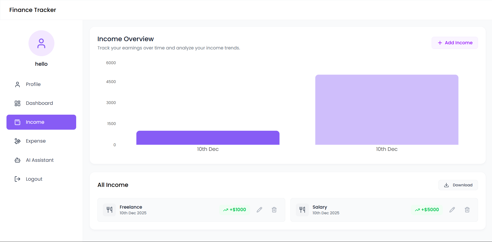
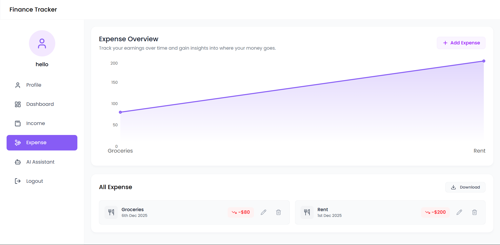
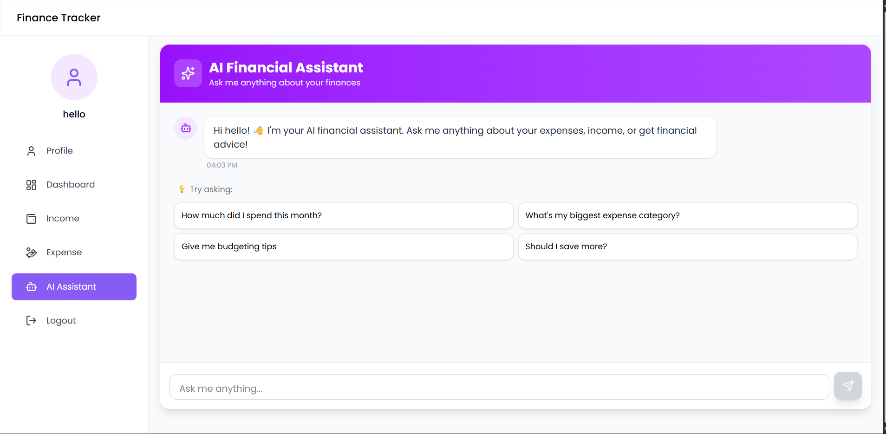

# Expense Tracker (Full-Stack Finance Tracker)

A **full-stack expense tracking web application** that helps users manage their income, expenses, and overall financial activity through an interactive dashboard and visual analytics.

The application includes user authentication, financial insights using charts, downloadable reports, and an AI-powered assistant for basic finance-related queries.

---

## Live Demo

- **Frontend (Vercel)**: https://expense-tracker-kappa-weld.vercel.app

---

## Features

### Authentication & Profile

- User Sign Up / Login
- Profile section to update user details and profile picture
- Secure authentication flow

### Dashboard

- Overview cards showing:
  - Total Balance
  - Total Income
  - Total Expenses
- Pie chart visualization of financial distribution
- Recent transactions list
- Insights for:
  - Last 30 days income
  - Last 30 days expenses

### Income Management

- Add, edit, and delete income entries
- Bar chart visualization for income trends
- View all income records

### Expense Management

- Add, edit, and delete expense entries
- Line chart visualization for expense trends
- Download expense data as an Excel file
- Detailed expense history

### AI Financial Assistant

- AI-powered assistant to answer finance-related questions such as:
  - Monthly spending analysis
  - Budgeting suggestions
  - Expense insights

### Logout

- Secure logout functionality

---

## Tech Stack

### Frontend

- React.js
- Tailwind CSS
- JavaScript
- npm

### Backend

- Node.js
- Express.js
- MongoDB

### Tools & Other

- Docker & Docker Compose
- REST APIs
- Chart libraries for data visualization

---

## Screenshots

### Profile



### Dashboard



### Income Management



### Expense Management



### AI Financial Assistant



---

## Getting Started (Run Locally)

### Prerequisites

Make sure you have:

- Node.js
- npm
- MongoDB (local or cloud)
- Docker (optional)

---

### Clone the Repository

```
git clone https://github.com/your-username/expense-tracker.git
cd expense-tracker
```

### Environment Variables

Create a `.env` file inside the `backend` folder

```
PORT=8080
MONGO_URI=your_mongodb_connection_string
JWT_SECRET=your_JWT_SECRET
GEMINI_API_KEY=your_GEMINI_KEY
```

Create a `.env` file inside `frontend/expense-tracker`:

```
VITE_API_URL=http://localhost:8080
```

### 🔐 Environment Variables Setup

The backend requires the following environment variables:

- `PORT` – Port on which the backend server runs
- `MONGO_URI` – MongoDB connection string
- `JWT_SECRET` – Secret key for JWT authentication
- `GEMINI_API_KEY` – API key for the AI financial assistant

#### How to obtain these values:

- **MongoDB URI**:  
  Create a free MongoDB cluster using MongoDB Atlas and copy the connection string.

- **JWT_SECRET**:  
  Use any strong random string (e.g., generated using a password generator).

- **Gemini API Key**:  
  Create an API key from Google AI Studio and enable Gemini API access.

### Install Dependencies

Backend

```
cd backend
npm install
npm start
```

Frontend

```
cd frontend/expense-tracker
npm install
npm run dev
```

### Run Using Docker (Optional but Recommended)

```
docker-compose up --build
```

---

## Project Purpose

This project was built to understand and implement full-stack development concepts including authentication, frontend–backend integration, data visualization, and expense management.

Additional features like profile management and an AI assistant were added to enhance the overall user experience.

---

## Feedback

Feel free to explore the project and suggest improvements.

---

## Author

Anurag Giri
